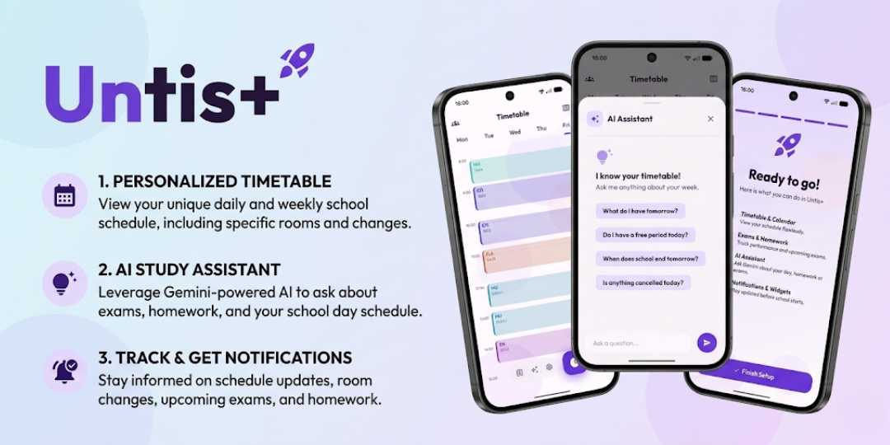
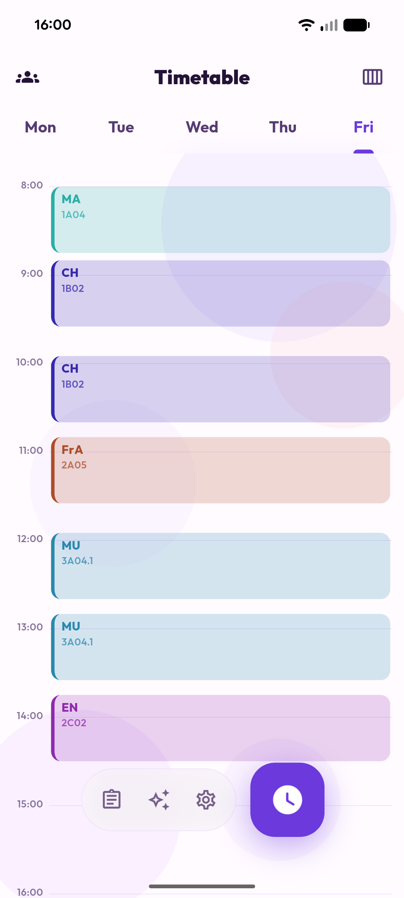
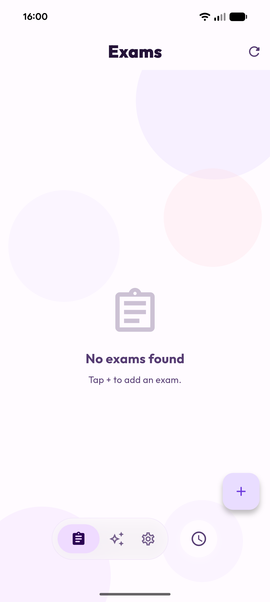
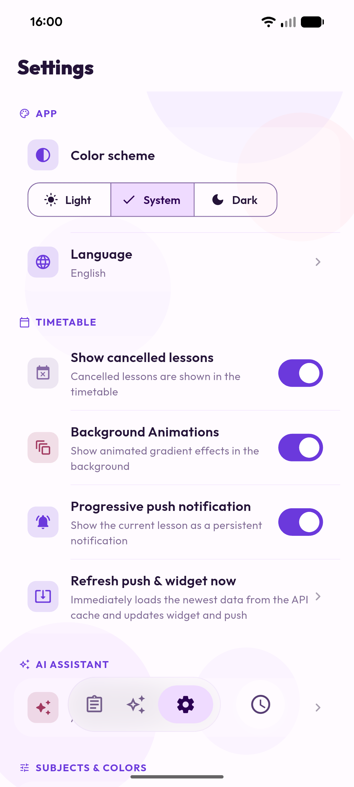
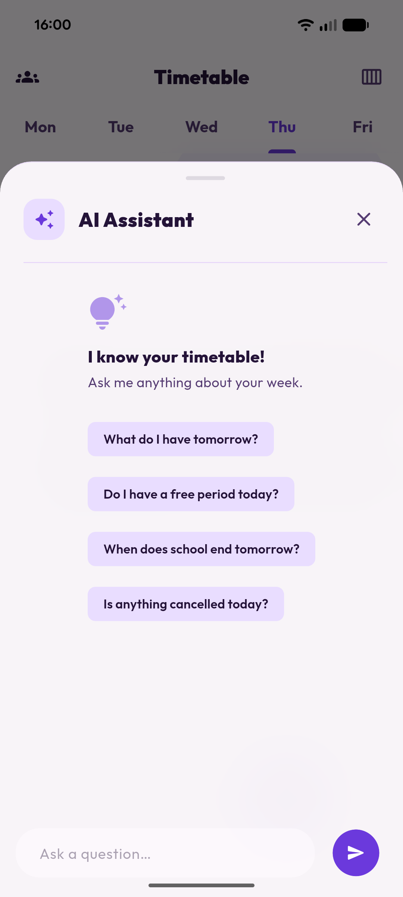
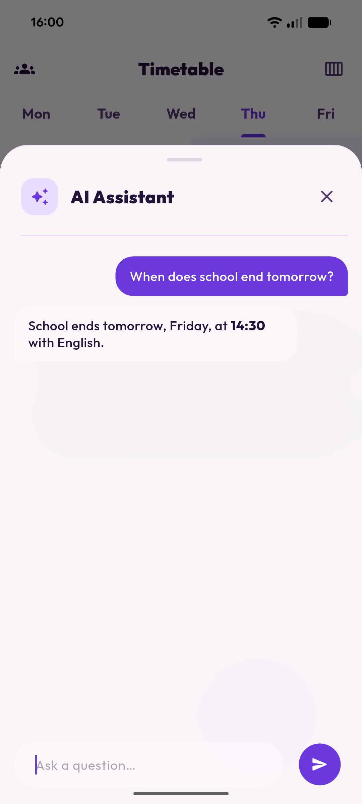
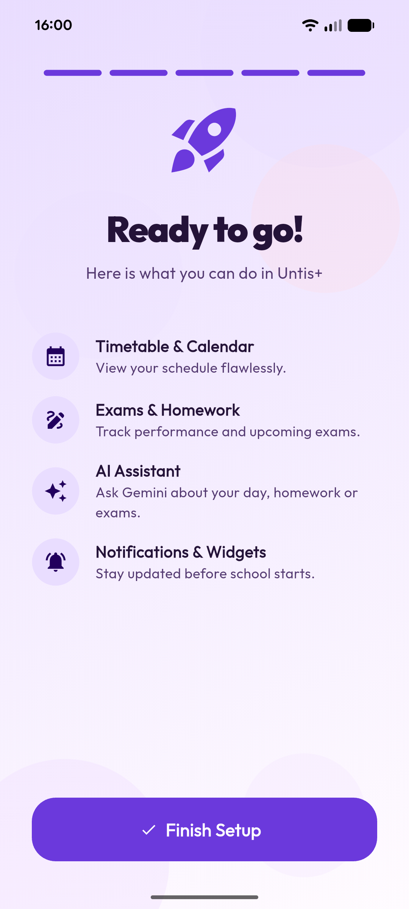

# Untis+

Untis+ is a Flutter client for **WebUntis** that focuses on fast access to your **timetable**, **exams**, and useful **notifications/widgets**.
Most settings are stored **locally on your device**. Optionally, you can enable a **Gemini-powered AI assistant** by providing your own API key.

## Contents

- [Features](#features)
- [Screenshots](#screenshots)
- [AI assistant (Gemini)](#ai-assistant-gemini)
- [Notifications & widgets](#notifications--widgets)
- [Privacy](#privacy)
- [Requirements](#requirements)
- [Development setup](#development-setup)
- [Build & release](#build--release)
- [Project structure](#project-structure)
- [Contributing](#contributing)
- [Disclaimer](#disclaimer)
- [License](#license)

## Features

- Login to a WebUntis server
- Weekly and daily timetable views
- Exam overview
- Gemini-powered AI assistant (optional)
- Persistent notification for the current lesson (optional)
- Home widgets (current lesson & daily schedule)
- Show/hide cancelled lessons
- Customize subject colors, hide subjects
- Languages: German, English, French, Spanish
- Light, dark, and system themes

## Screenshots

<table>
	<tr>
		<td></td>
		<td></td>
		<td></td>
	</tr>
	<tr>
		<td></td>
		<td></td>
		<td></td>
	</tr>
</table>

## AI assistant (Gemini)

The AI assistant is available after you add a **Gemini API key**.

### 1) Create an API key

1. Open Google AI Studio.
2. Create an API key.
3. Copy the key.

Tip: The app also shows the link `aistudio.google.com/app/apikey` in the settings dialog.

### 2) Add it in the app

1. Open **Settings**.
2. Open **AI Assistant**.
3. Tap **Gemini API Key**.
4. Paste the key and save.

### Notes

- The assistant is not available without an API key.
- If you were using an older OpenAI key, the value is automatically migrated to `geminiApiKey`.
- Your API key is stored **only locally** on your device.

## Notifications & widgets

Untis+ can refresh data in the background to keep widgets and notifications up to date.

- The “current lesson” persistent notification can be toggled in settings.
- Widgets and notifications update automatically when the OS allows it.
- After first login, data is loaded once immediately so widgets can show content right away.

If Android or iOS asks for permissions, grant them so notifications and background updates can work correctly.

## Privacy

Untis+ stores configuration data **locally** on your device, including:

- Session ID
- School server and school name
- Username and password
- App settings
- Gemini API key (if configured)

Data is sent only to:

- Your WebUntis server (authentication and timetable/exam data)
- Google Gemini API (only if you enable the AI assistant)

The app does **not** use analytics or tracking.

## Requirements

- Flutter SDK 3.11 or newer
- A WebUntis account from your school
- (Optional) A Gemini API key for AI features
- Notification permissions on Android/iOS for push features

## Development setup

Install dependencies:

```bash
flutter pub get
```

Run on a device/emulator:

```bash
flutter run
```

## Build & release

Android (APK):

```bash
flutter build apk --release
```

Android (App Bundle / Play Store):

```bash
flutter build appbundle --release
```

Other platforms (depending on your enabled targets):

```bash
flutter build ios --release
flutter build windows --release
flutter build macos --release
flutter build linux --release
flutter build web --release
```

Note: For store releases you usually need signing (Android keystore / iOS provisioning). Flutter’s official docs cover the platform-specific steps.

## Project structure

- [lib/main.dart](lib/main.dart) – entry point and main UI
- [lib/services/background_service.dart](lib/services/background_service.dart) – background updates for widgets/notifications
- [lib/services/notification_service.dart](lib/services/notification_service.dart) – local notifications
- [lib/services/widget_service.dart](lib/services/widget_service.dart) – widget data and widget updates

## Contributing

Issues and pull requests are welcome.

- Please describe the expected/actual behavior and include screenshots if possible.
- Keep changes focused and consistent with the existing code style.

## Disclaimer

Untis+ is **not affiliated with, endorsed by, or connected to WebUntis** or its respective owners.