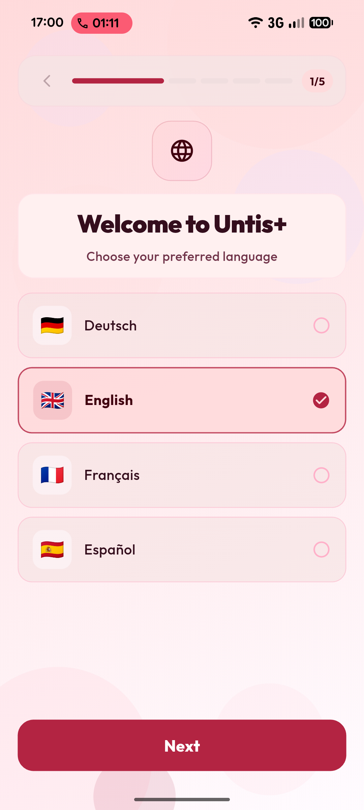
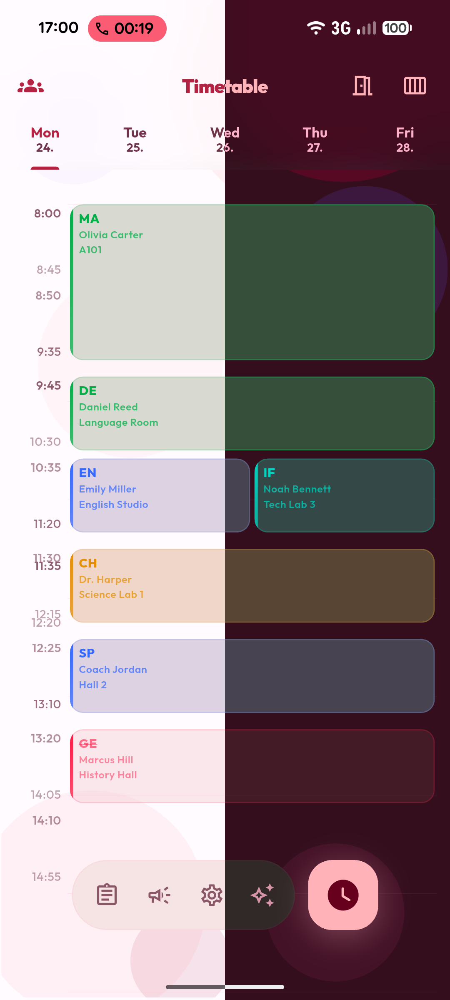
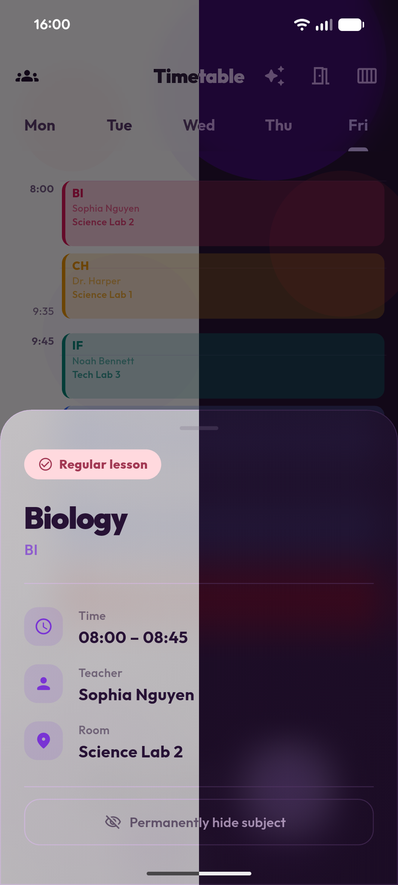
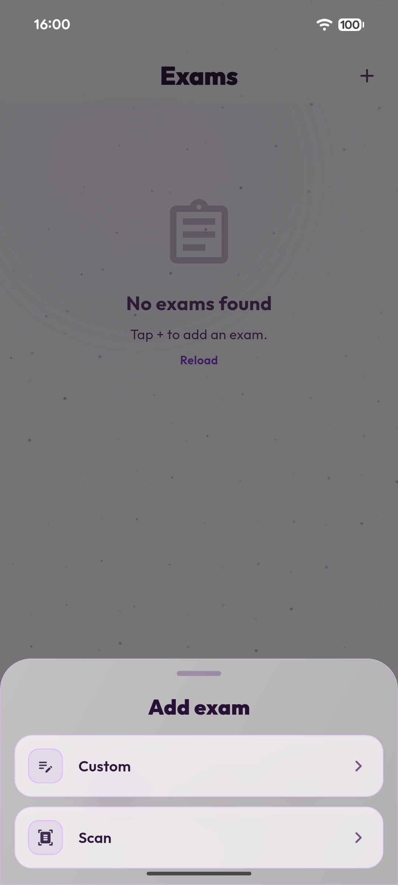
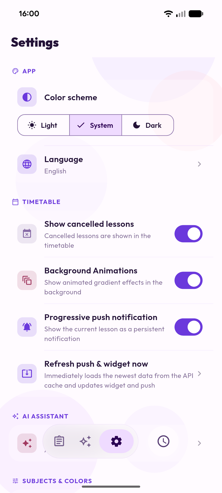

# UntisPlus

<p align="center">
  
</p>

<p align="center">
  <strong>A sleek, privacy-first companion app for WebUntis.</strong>
</p>

<p align="center">
  
  
  
  
</p>

---

## ⚡ Overview

| Aspect | Specification |
| :--- | :--- |
| **Description** | A modern, secure, and intuitive Flutter client for students and teachers to manage school schedules, tasks, and communications without central data exposure. |
| **Data Policy** | Private by default. All authentication details, credentials, and schedule data remain strictly on the local device. |
| **Current Version** | `5.0.0` |
| **Target Platforms** | Android |

---

## ✨ Features

* **Advanced Timetable:** Fast, fluid, and optimized navigation for daily and weekly class schedules.
* **Exam & Info Tracker:** Consolidated overview of upcoming exams and direct broadcast announcements from your school.
* **Smart Utilities:** Built-in free room finder and home screen widgets for immediate status checks.
* **Local Intelligence:** Seamless integration with on-device assistive AI features to manage workflows privately.

---

## 📸 Screenshots

| Onboarding | Timetable | Lesson Details |
| :---: | :---: | :---: |
|  |  |  |

| Exams | School Info | Settings |
| :---: | :---: | :---: |
|  |  |  |

---

## 🗺️ Roadmap

| Feature / Goal | Status |
| :--- | :---: |
| UI Refactor (Modernized aesthetics and enhanced user experience) | Done |
| Streamlined Onboarding Flow | Done |
| Multi-Account / Multi-School Support | Planned |
| Dynamic Lockscreen & Next-Lesson Widgets | Planned |
| Native Offline/Local AI Model Integration | Planned |
| Dynamic Smart Alarm Sync (Wake up based on timetable changes) | Planned |

---

## 🛠️ Tech Stack & Key Dependencies

| Dependency | Purpose |
| :--- | :--- |
| **`http`** | WebUntis API communication |
| **`shared_preferences`** | Encrypted local token and setting persistence |
| **`dynamic_color`** | Material You dynamic theme integration |
| **`home_widget`** | Native Android and iOS widget connectivity |
| **`flutter_local_notifications`** | Time-critical lesson alerts and schedule update tracking |

---

## 📦 Project Structure

.
├── assets/                    # Graphic elements and app icons
├── lib/

│   ├── app/                   # Central application routing configuration
│   ├── core/                  # State engines, themes, and time utilities
│   ├── screens/               # System views, settings hub, and setup guides
│   ├── services/              # Notification, background sync, and backup engines
│   ├── web/                   # Web-specific platform adaptions
│   └── widgets/               # Reusable UI elements and background filters
└── pubspec.yaml               # Package definitions and metadata


---

## 🚀 Development Setup

### System Prerequisites
Ensure the Flutter SDK is installed and configured in your environment variable path.

### Execution

```bash
# Clone the codebase
git clone [https://github.com/ninocss/UntisPlus.git](https://github.com/ninocss/UntisPlus.git)

# Navigate into the project folder
cd UntisPlus

# Resolve project dependencies
flutter pub get

# Launch the application in debug mode
flutter run
```

👥 Contributing

Fork the repository.

Clone your fork: git clone https://github.com/your-username/UntisPlus.git

Create a feature branch: git checkout -b feature/your-feature

Commit changes using clear messages: git commit -am 'Add explicit feature description'

Push to the branch: git push origin feature/your-feature

Open a Pull Request against the main branch.

But please give Credits to UntisPlus or your forked repo! ❤️

⚠️ Disclaimer
UntisPlus is an independent developer project. It is not affiliated, associated, authorized, endorsed by, or in any way officially connected with WebUntis or any of its subsidiaries or affiliates.
