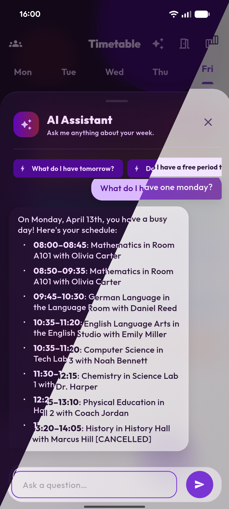

<h1 align="center">Untis+</h1>

<p align="center">
  
</p>

<p align="center">
  A modern, Android-first Flutter client for WebUntis: timetable, exams, school info,
  widgets, and optional AI features.
</p>

<p align="center">
  <a href="https://github.com/ninocss/UntisPlus/releases">
    
  </a>
  
  
</p>

## Overview

Untis+ focuses on a clean, fast school companion:

- Weekly timetable with lesson details, cancellations, and substitutions
- Exams overview (from WebUntis) plus custom exams
- Free room search (based on your school’s configured time grid)
- School info / announcements feed
- Widgets + background refresh and multiple notification types
- Optional AI assistant (bring your own API key)

## Screenshots

<table>
  <tr>
    <td align="center"><br />Onboarding</td>
    <td align="center"><br />Timetable</td>
  </tr>
  <tr>
    <td align="center"><br />Lesson details</td>
    <td align="center"><br />Exams</td>
  </tr>
  <tr>
    <td align="center"><br />School info</td>
    <td align="center"><br />Settings</td>
  </tr>
  <tr>
    <td align="center"><br />AI assistant</td>
    <td align="center"></td>
  </tr>
</table>

## Features

| Area | What you get |
| --- | --- |
| Timetable | Weekly view, lesson details, show/hide cancellations, hide subjects |
| Free rooms | Quickly list rooms that are currently free |
| Exams | API exams + custom exams, import/export, optional AI-assisted import |
| School info | School announcements/notifications feed |
| Widgets | “Current lesson” + “Daily schedule” home screen widgets |
| Notifications | Progressive “current lesson”, daily briefing, important changes |
| Demo mode | Try the app without logging in |
| Languages | German, English, French, Spanish, Greek |
| Appearance | Light/dark/system, blur + animated backgrounds |
| Login | WebUntis login with optional 2FA/OTP support |
| Updates | Update notifications via GitHub Releases |

## AI (Optional)

Untis+ includes optional AI features (for example: chatting about your timetable and importing exams from images).

- You bring your own API key. Keys are stored locally on your device.
- Supported providers: Gemini, OpenAI, Mistral, and custom endpoints (OpenAI- or Gemini-compatible).

When AI is enabled, prompts may include timetable/exam context and will be sent to the selected provider.

## Widgets & Background Refresh

Untis+ can refresh data periodically (when Android allows it) to keep widgets and notifications up to date.

- Progressive push notification: shows your current/next lesson and offers quick actions (e.g. free rooms)
- Daily briefing notification: short overview of your day (before your first lesson)
- Important changes: cancellations, room changes, substitutions

## Privacy

Untis+ is local-first (no analytics, no tracking). It stores data on your device to provide background updates:

- WebUntis session + school/server info
- Username + password (used for background refresh)
- App settings (theme, language, notification toggles, hidden subjects, …)
- AI provider settings and API keys (only if configured)

Network traffic happens only to:

- Your school’s WebUntis server (authentication + timetable/exams/info)
- Your selected AI provider (only if AI features are enabled)

## Installation

1. Download the latest APK from https://github.com/ninocss/UntisPlus/releases
2. Install it on your Android device.
3. Sign in with your WebUntis account (or use demo mode).

## Development

Install dependencies:

```bash
flutter pub get
```

Run:

```bash
flutter run
```

Build a release APK:

```bash
flutter build apk --release
```

## Project Structure

- `lib/main.dart` — app entry point (most UI lives in parts)
- `lib/l10n.dart` — localization strings
- `lib/screens/onboarding_flow.dart` — onboarding + login
- `lib/screens/main_navigation_screen.dart` — bottom navigation (Timetable / Exams / School info / Settings)
- `lib/services/background_service.dart` — background refresh + update checks
- `lib/services/notification_service.dart` — notifications (including actions)
- `lib/services/widget_service.dart` — home screen widgets
- `lib/services/demo_mode_service.dart` — demo data

## Disclaimer

Untis+ is not affiliated with, endorsed by, or connected to WebUntis or its respective owners.