<p align="center">
	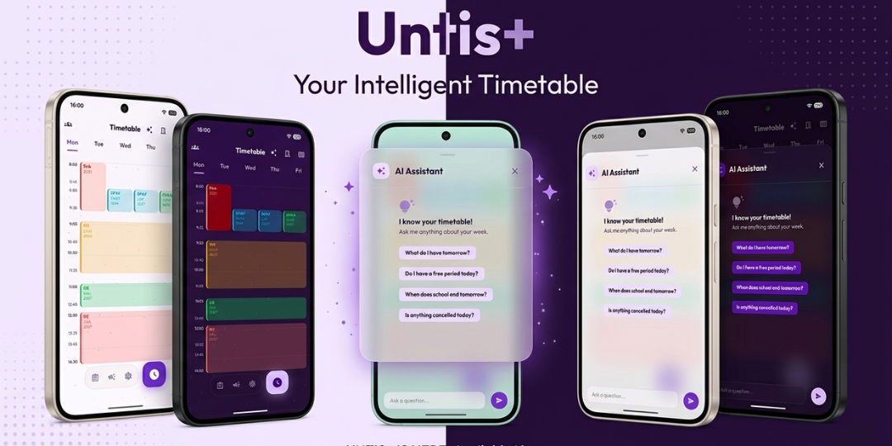
</p>

<h1 align="center">Untis+</h1>

<p align="center">
	Moderner Flutter-Client fur WebUntis mit Stundenplan, Prufungen, freien Raumen,
	Schulinfos, Widgets und optionalem KI-Assistenten.
</p>

<p align="center">
	<a href="https://github.com/ninocss/UntisPlus/releases"></a>
	
	
	
</p>

<p align="center">
	<strong>Privacy by default:</strong> Deine Daten bleiben auf deinem Gerat.
	KI-Funktionen sind optional und nutzen deinen eigenen Gemini API-Key.
</p>

## Inhaltsverzeichnis

- [Warum Untis+?](#warum-untis)
- [Installation](#installation)
- [Features](#features)
- [Screenshots](#screenshots)
- [KI-Assistent (Gemini)](#ki-assistent-gemini)
- [Widgets und Benachrichtigungen](#widgets-und-benachrichtigungen)
- [Datenschutz](#datenschutz)
- [Voraussetzungen](#voraussetzungen)
- [Development Setup](#development-setup)
- [Projektstruktur](#projektstruktur)
- [Contributing](#contributing)
- [Disclaimer](#disclaimer)

## Warum Untis+?

Untis+ fokussiert sich auf eine schnelle, ubersichtliche und alltagstaugliche Nutzung:

- Saubere Tages- und Wochenansicht fur den Stundenplan
- Prufungen inklusive eigener Eintrage sowie Import/Export
- Freie-Raume-Suche und Schulinfos in einer App
- Zuverlassige Widgets und Hintergrund-Updates
- Optionaler KI-Assistent fur schnelle Fragen im Schulalltag

## Installation

1. Lade die aktuelle APK aus den [GitHub Releases](https://github.com/ninocss/UntisPlus/releases) herunter.
2. Installiere die APK auf deinem Android-Gerat.
3. Melde dich mit deinem WebUntis-Konto an oder starte im Demo-Modus.

## Features

| Bereich | Beschreibung |
| --- | --- |
| Stundenplan | Tages- und Wochenansicht, Abwesenheiten, Ausfalle, Farbanpassungen |
| Prufungen | Prufungsubersicht, eigene Prufungen, Import/Export |
| Freie Raume | Schnell sehen, welche Raume aktuell frei sind |
| Schulinfos | Feed fur schulische Mitteilungen |
| Widgets | Homescreen-Widgets mit aktuellen Daten |
| Benachrichtigungen | Persistente "Aktuelle Stunde"-Benachrichtigung |
| KI (optional) | Gemini-Integration mit eigenem API-Key |
| Demo-Modus | App testen ohne WebUntis-Login |
| Sprachen | Deutsch, Englisch, Franzosisch, Spanisch, Griechisch |
| Themes | Hell, Dunkel, System + animierte Hintergrunde |

## Screenshots

### Stundenplan

<table>
	<tr>
		<td align="center">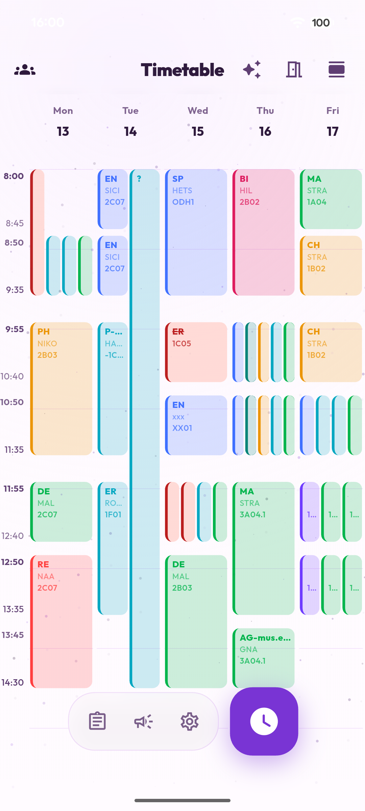<br />Wochenansicht</td>
		<td align="center">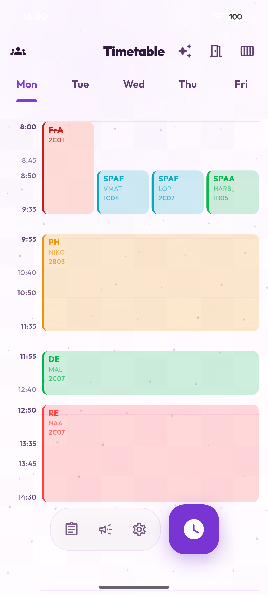<br />Tagesansicht</td>
	</tr>
	<tr>
		<td align="center">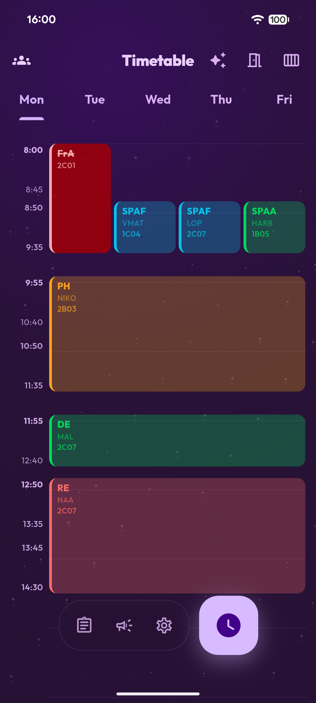<br />Tagesansicht, Dark Mode</td>
		<td align="center"></td>
	</tr>
</table>

### Prufungen, freie Raume und Schulsetup

<table>
	<tr>
		<td align="center"><br />Prufungen</td>
		<td align="center">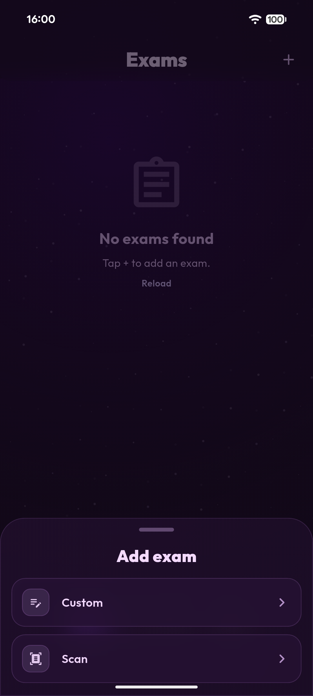<br />Prufungen, Dark Mode</td>
	</tr>
	<tr>
		<td align="center">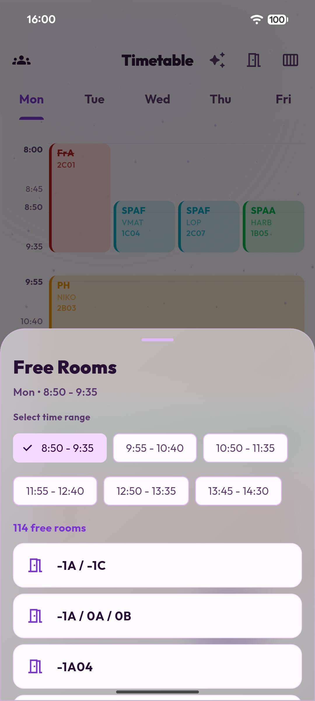<br />Freie Raume</td>
		<td align="center">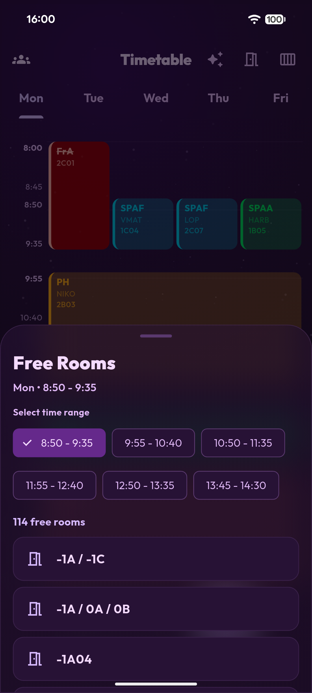<br />Freie Raume, Dark Mode</td>
	</tr>
	<tr>
		<td align="center">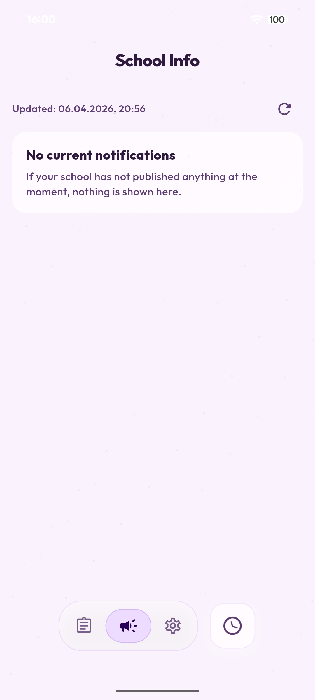<br />Schulinfos</td>
		<td align="center">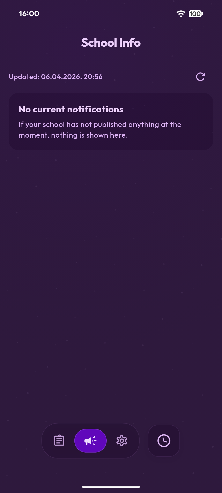<br />Schulinfos, Dark Mode</td>
	</tr>
	<tr>
		<td align="center">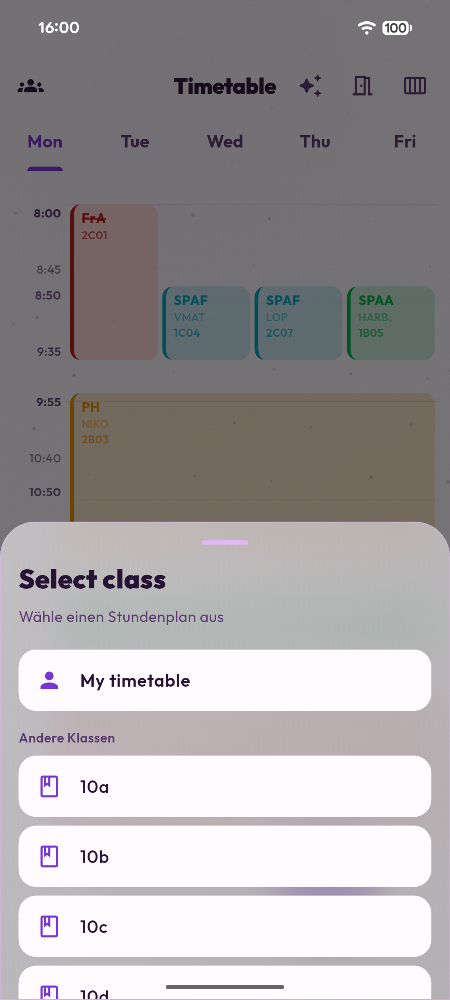<br />Klasse auswahlen</td>
		<td align="center">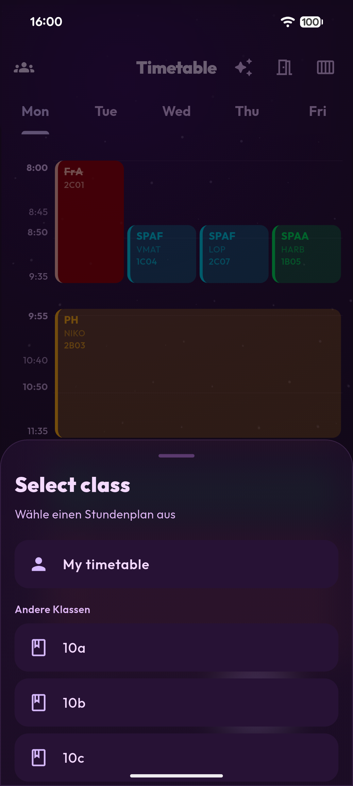<br />Klasse auswahlen, Dark Mode</td>
	</tr>
</table>

### KI-Assistent

<table>
	<tr>
		<td align="center">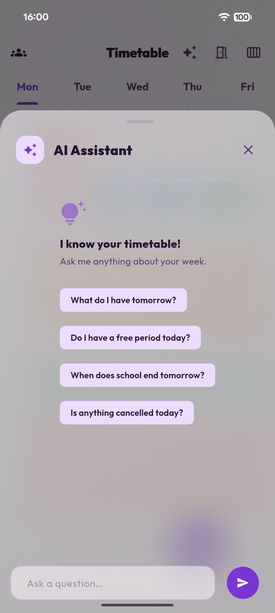<br />KI-Assistent</td>
		<td align="center">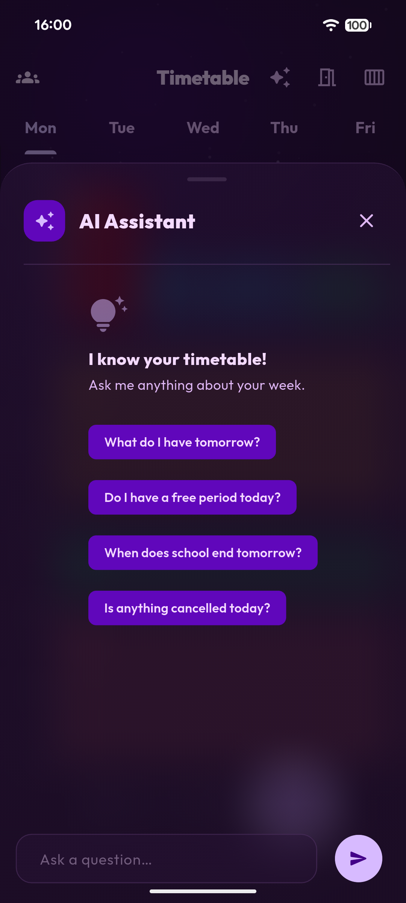<br />KI-Assistent, Dark Mode</td>
	</tr>
	<tr>
		<td align="center">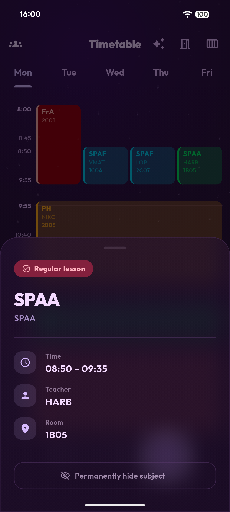<br />Details, Dark Mode</td>
		<td align="center"></td>
	</tr>
</table>

## KI-Assistent (Gemini)

Der KI-Assistent wird aktiv, sobald du deinen eigenen Gemini API-Key hinterlegst:

1. Offne [Google AI Studio](https://aistudio.google.com/).
2. Erstelle einen neuen API-Key.
3. Trage den Key in der App unter **Einstellungen > KI-Assistent > Gemini API-Key** ein.

Der API-Key wird nur lokal auf deinem Gerat gespeichert.

## Widgets und Benachrichtigungen

Untis+ kann Daten im Hintergrund aktualisieren, damit Widgets und Benachrichtigungen aktuell bleiben.

- Aktiviere die persistente "Aktuelle Stunde"-Benachrichtigung in **Einstellungen > Progressive Push Notification**.
- Widgets und Benachrichtigungen aktualisieren sich automatisch, sobald Android Hintergrundaktualisierungen erlaubt.
- Nach dem ersten Login werden Daten direkt geladen, damit Widgets sofort Inhalte anzeigen konnen.

Wenn Android Berechtigungen fur Benachrichtigungen oder Hintergrundaktivitaten abfragt, sollten diese erlaubt werden.

## Datenschutz

Untis+ speichert Daten lokal auf deinem Gerat, unter anderem:

- Session-ID
- Schulserver und Schulname
- Benutzername und Passwort
- App-Einstellungen
- Gemini API-Key (falls konfiguriert)

Daten werden nur an folgende Dienste ubertragen:

- Deinen WebUntis-Server fur Login, Stundenplan- und Prufungsdaten
- Google Gemini API, ausschliesslich wenn der KI-Assistent aktiviert ist

Untis+ verwendet kein Tracking und keine Analytics.

## Voraussetzungen

- Flutter SDK 3.11 oder neuer
- WebUntis-Konto deiner Schule
- Optional: Gemini API-Key fur KI-Funktionen

## Development Setup

Abhangigkeiten installieren:

```bash
flutter pub get
```

App auf Emulator oder Gerat starten:

```bash
flutter run
```

Release-APK bauen:

```bash
flutter build apk --release
```

## Projektstruktur

- [lib/main.dart](lib/main.dart) - App-Einstiegspunkt
- [lib/l10n.dart](lib/l10n.dart) - Lokalisierung (DE, EN, FR, ES, EL)
- [lib/app/untis_plus_app.dart](lib/app/untis_plus_app.dart) - App-Shell und Theme-Konfiguration
- [lib/screens/main_navigation_screen.dart](lib/screens/main_navigation_screen.dart) - Hauptnavigation
- [lib/screens/onboarding_flow.dart](lib/screens/onboarding_flow.dart) - Login und Schulsetup
- [lib/services/background_service.dart](lib/services/background_service.dart) - Hintergrundaktualisierung
- [lib/services/notification_service.dart](lib/services/notification_service.dart) - Persistente Benachrichtigungen
- [lib/services/widget_service.dart](lib/services/widget_service.dart) - Homescreen-Widgets
- [lib/services/demo_mode_service.dart](lib/services/demo_mode_service.dart) - Demo-Daten

## Contributing

Issues und Pull Requests sind willkommen.

- Beschreibe erwartetes und tatsachliches Verhalten.
- Fuge Screenshots hinzu, wenn sich UI-Verhalten andert.
- Halte Anderungen klein, fokussiert und konsistent mit dem Stil des Projekts.

## Disclaimer

Untis+ ist nicht mit WebUntis oder dessen Rechteinhabern verbunden und wird von diesen weder unterstutzt noch empfohlen.